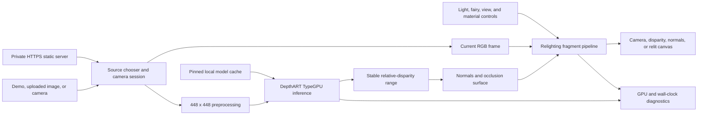

# Architecture

## Scope

This is a browser-only relative-disparity and relighting pipeline. The HTTPS server distributes
static files and pinned model bundles; it does not receive photographs, camera frames, inference
results, or telemetry.

## Components

### Browser shell

- `index.html` and `styles.css` define the responsive workbench, chooser, controls, fallback, and
  diagnostic presentation.
- `index.ts` coordinates source changes, model selection, renderer lifetime, benchmarks, view
  switching, accessibility labels, and the exported qualification record.
- `chooser.ts` and `camera-session.ts` isolate uploaded-image and front/rear-camera lifecycles.
- `light-input.ts` converts pointer input into the scene-relative light position.

### Model acquisition and storage

- `scripts/fetch-models.mjs` downloads two model bundles plus `LICENSE`, `NOTICE`, and the model card
  from one immutable Hugging Face revision.
- Every artifact has an exact byte count and SHA-256 pin. Existing mismatches fail closed rather than
  being overwritten.
- `stage-models.mjs` re-verifies the local cache and copies the five artifacts into `dist/models`
  after Vite empties the output directory.
- `model-store.ts` handles browser cache use and integrity checking. `chooser.ts` selects FP16 only
  when `shader-f16` is actually available; otherwise it selects FP32.

Model weights are runtime artifacts and are excluded from Git.

### Relative-disparity inference

The `inference/` modules are derived from the official TypeGPU example. They parse the DepthART
bundle, allocate typed GPU resources, preprocess the source, dispatch the convolution/selective-scan
graph, stabilise the disparity range, and expose a 448 x 448 affine-invariant relative-disparity
surface.

The output is not calibrated depth. Its ordering is useful for qualitative surface reconstruction,
occlusion, normals, and relighting, but its values cannot be converted to physical distance without
a separately calibrated reconstruction system.

### Relighting and procedural fairy

- `renderer.ts` owns the TypeGPU root, textures, typed uniform state, timestamp query resources,
  render pipeline, canvas sizing, and optional GPU readback.
- `shaders.ts` derives stable normals and ambient occlusion, ray-marches scene-relative shadows, and
  composites the selected diagnostic or relit view.
- The original procedural fairy is generated analytically in the fragment shader. Four wing masks
  flutter over time and drive a warm body light plus cyan and pink wing lobes.
- A scene-relative caster plane projects the four wing masks into the central light. The Shadow
  control scales the resulting silhouette.
- A bright/neutral/detail cue and surface normal feed a three-lobe specular approximation. The
  Reflections control scales it. It can suggest a moving glint on glasses but does not detect lenses
  or trace an optical reflection.

### Live-camera scheduling

Only one inference/render operation may be in flight. Camera callbacks arriving while the GPU is
busy are counted as skipped inputs rather than queued. This provides bounded latency and prevents an
unbounded GPU workload.

The first completed camera frame is the cold sample; the next four completed frames form the warmed
median. Live FPS counts completed GPU pipeline frames. Dropped frames count camera inputs skipped
while work is in flight, and both counters reset when the page returns to the foreground.

### Timing

When `timestamp-query` is exposed and enabled, compute, render, and full-frame timings come from GPU
timestamps. Browsers may privacy-quantise those values. Otherwise the UI labels a submission-to-
queue-completion wall clock explicitly; it never presents that fallback as true GPU time.

## Privacy and security boundary

- The browser fetches static JavaScript, the selected model, and the bundled public demo image.
- Uploaded files become tab-local browser objects. Camera frames remain local media/GPU resources.
- The application defines no upload endpoint and the server accepts only GET and HEAD.
- The server applies CSP, cross-origin isolation, same-origin resource policy, a camera-only
  permissions policy, no-referrer, and MIME-sniffing protection.
- Path resolution is constrained to `dist/` and traversal attempts are rejected.
- The server binds to `127.0.0.1` unless `TYPEGPU_HOST` is set explicitly.
- Certificates, keys, model binaries, build output, browser profiles, and camera imagery are excluded
  from version control.

Tailnet binding does not create authentication inside the application. The tailnet ACL remains the
access-control boundary; this repository does not alter Tailscale Serve or public ingress.

## Build and qualification flow

1. `pnpm install --frozen-lockfile` installs the exact dependency graph.
2. `pnpm models:fetch` downloads and verifies immutable model artifacts.
3. TypeScript and Oxlint validate authored code, including TypeGPU-aware rules.
4. Vite and `unplugin-typegpu` build the browser application.
5. `stage-models.mjs` verifies and stages model/licence artifacts after the Vite clean build.
6. `qualify.mjs` can drive a static image through a local Chromium WebGPU path, capture diagnostics,
   and compare four non-black readbacks. Its screenshots are ignored by Git.

## Extension boundary for the Collingham workbench

A future photo-depth workbench should consume normalised relative disparity as a user-scaled height
field, not as distance. Keep manual zero/relief controls, user-placed scene-relative light depth,
optional material/specular masks, and the licensing/non-metric warning visible. Calibrated geometry,
multi-view reconstruction, persistent photo storage, and public deployment are separate projects
with separate acceptance and privacy requirements.
