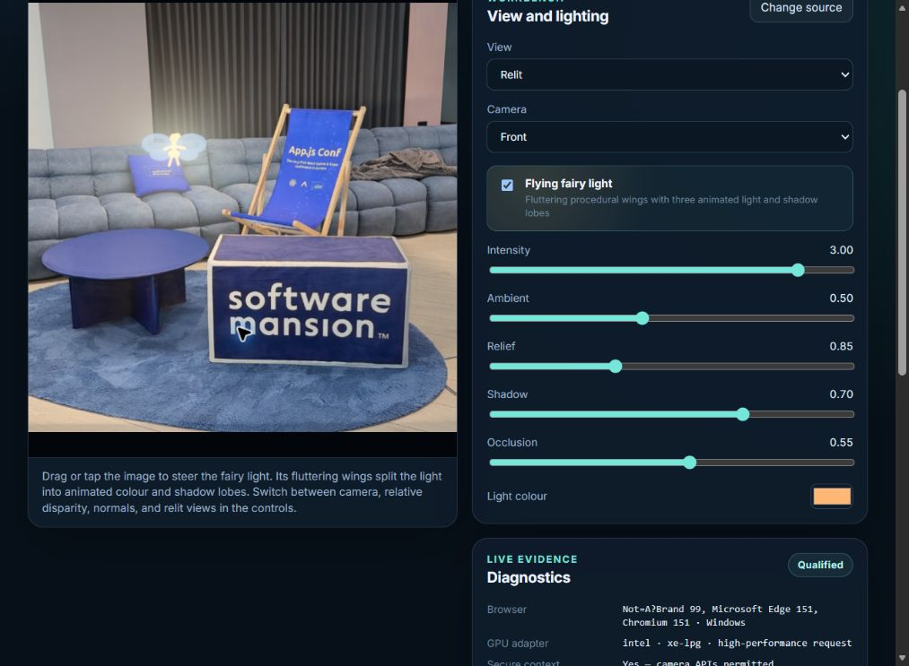

# TypeGPU Monocular Light Fairy

An unofficial, local-browser qualification build derived from TypeGPU's official **Monocular Light
Injection** example. It estimates affine-invariant relative disparity in WebGPU, derives normals,
and relights a photograph or live camera frame with a procedural flying fairy.



> Relative disparity is not metric depth. This project does not measure metres, centimetres, camera
> distance, object size, or any other real-world distance.

## What it provides

- Bundled bathroom mirror photograph, local photograph upload, and front/rear live camera sources.
- Camera, relative-disparity, normals, and relit views.
- An original procedural fairy that follows wide swooping paths, rolls into turns, pitches through
  depth changes, and changes scene-relative height rather than merely hovering in place.
- One compact, softly pulsing firefly-style abdomen light; the wings are translucent surfaces, not
  secondary light sources.
- Soft projected wing-shaped occlusion and a tunable single-source reflective-glint approximation.
- A demo-only fixed mask for the bathroom mirror, adding a reflected fairy/light, subtle glass-layer
  displacement, and an offset silhouette. It is explicitly a screen-space study, not optical ray
  tracing or general mirror detection.
- Browser, adapter, WebGPU, `shader-f16`, model, compilation, inference, FPS, dropped-frame, and
  timing-source diagnostics.
- FP16 model selection when `shader-f16` is exposed, with a pinned FP32 fallback.
- Local-only image processing. Photographs and camera frames are neither uploaded nor retained.
- A clear WebGPU-unavailable fallback.

This repository is deliberately not a public deployment. The included HTTPS server binds to
`127.0.0.1` by default. If you bind it to a tailnet address, the tailnet and its ACLs remain the
access-control boundary.

## Immutable provenance

| Input | Pin | Licence / checksum |
| --- | --- | --- |
| [TypeGPU](https://github.com/software-mansion/TypeGPU) | `40dc5c915d9e869daf7c37e4c0c62904f442002d` | MIT; licence SHA-256 `abfe140e29a001c90ded00cf8a8f418cf3f35cb6252c148c7dd4406fa07e2337` |
| Official example | `apps/typegpu-docs/src/examples/image-processing/monocular-light-injection` | From the pinned TypeGPU commit |
| [Converted DepthART weights](https://huggingface.co/reczkok/depthart-typegpu) | `913a7c13ddfbd48549279555d1db98172e8e5e0d` | Declared Apache-2.0; see licensing note |
| FP16 balanced model | 13,662,992 bytes | SHA-256 `e6d7b65bd2888771790d3cc3ad827133f0b014f05010347b6fc6fc891ff9e19c` |
| FP32 fallback | 23,994,512 bytes | SHA-256 `adc5352f2fc83d1fd7e740ed32b8a0bd7862cef463a430d23d6071990e822aef` |
| User-owned bathroom photograph (`02.jpg`) | 66,624 bytes; 568 × 380 | SHA-256 `5715ffefb4f7056a8c15c00b849856116d488b2a8303b22d4886995bc9d8403e`; byte-identical copy; ownership confirmed by the user; excluded from the MIT code licence |

`public/qualification-metadata.json` is the machine-readable provenance record. Model binaries are
not committed. `pnpm models:fetch` downloads exactly the five pinned model-repository artifacts and
rejects any size or SHA-256 mismatch.

## Requirements

- Node.js `24` or newer. Qualification used Node `24.19.0`.
- Corepack and pnpm `11.1.2` using the integrity-pinned `packageManager` declaration.
- A current Chromium-family browser with WebGPU.
- HTTPS for camera use outside `localhost`.
- OpenSSL only if using the supplied local certificate helper.

No global npm or pnpm package installation is required.

## Install and build

```bash
corepack pnpm install --frozen-lockfile
corepack pnpm models:fetch
corepack pnpm verify
```

The build is written to `dist/`. The model-fetch and post-build staging scripts independently verify
the same byte counts and SHA-256 pins.

## Run the private HTTPS preview

For a loopback-only preview:

```bash
bash scripts/generate-local-cert.sh
corepack pnpm preview:https
```

Trust `certs/typegpu-preview-ca.crt` only on devices used for this preview and verify the fingerprint
printed by the script. Never bypass a browser certificate warning. The server defaults to
`https://127.0.0.1:9443/` and refuses methods other than GET and HEAD.

To use an existing private tailnet route, generate a certificate containing that private hostname
and address, then bind explicitly:

```bash
TYPEGPU_CERT_HOST='private-host.example.ts.net' \
TYPEGPU_CERT_IP='100.64.0.10' \
  bash scripts/generate-local-cert.sh

TYPEGPU_HOST='100.64.0.10' corepack pnpm preview:https
```

Replace the example values with the actual private route. This does not configure Tailscale Serve,
DNS, ACLs, or public ingress. For an existing certificate, set `TYPEGPU_CERT` and `TYPEGPU_KEY`
instead.

## Using the demo

1. Choose the bundled bathroom demo, a local photograph, or a camera.
2. Start local processing and wait for the model hash and pipeline compilation to complete.
3. Switch among Relit, Camera, Relative disparity, and Normals.
4. Leave the fairy unpinned for autonomous swoops, climbs, dives, and banked turns. Its analytic
   plane foreshortens with projected roll and pitch instead of remaining a camera-facing cut-out.
   Drag or tap the image to pin it; tap the fairy again to resume flight. Scroll or pinch to change
   its depth.
5. Adjust Shadow for the soft projected wing silhouettes and Reflections for the compact abdomen
   glint. A glasses response is an artistic screen-space approximation, not lens ray tracing.
6. In the bundled bathroom demo, compare Camera and Relit views to inspect the fixed large-mirror
   study. Its reflected sprite, glass-layer displacement, and offset shadow are scene-specific
   artistic cues. They are not inferred for uploaded or camera images.

For camera tests, record diagnostics only. Do not retain screenshots containing camera frames.

## Verification

```bash
corepack pnpm typecheck
corepack pnpm lint
corepack pnpm build
corepack pnpm audit --audit-level=high
git diff --check
```

The optional static browser qualification expects a running HTTPS preview and a local Chromium
binary:

```bash
TYPEGPU_PREVIEW_URL='https://127.0.0.1:9443/?autorun=1&benchmark=1' \
  corepack pnpm qualify:static
```

## Qualification status on 2026-08-26

- **PASS:** hpubuntu Intel Gen9, WebGPU + `shader-f16`, FP16 model, true GPU timestamp queries,
  59.22 FPS static render loop.
- **PASS:** MSI Edge 151 on Intel Xe-LPG, FP16 model, static and front-camera processing, all four
  views, 14.7 completed live pipeline frames/s at Shadow 0.85 and Reflections 0.85.
- **BLOCKED:** Quadro P5000 FP32 run lost its Vulkan device when protected GPU workloads occupied
  memory. Nothing was killed to obtain a benchmark.
- **PENDING:** Pixel 8 Pro front/rear camera acceptance, MSI native file-picker acceptance, and human
  visual judgement of the glasses glint.

No live camera image is committed. The retained diagnostic records are documented in
[`evidence/README.md`](evidence/README.md).

## Firefly-flight qualification on 2026-08-27

- **PASS:** hpubuntu Intel Gen9, FP16, true GPU timestamps, four non-black output readbacks, 58.81
  FPS, and a 10.05 ms warmed median GPU render pass.
- **PASS:** MSI Chrome 151 on Intel Xe-LPG, FP16, true GPU timestamps, four non-black output
  readbacks, 60.01 FPS, and a 3.93 ms warmed median GPU render pass.
- **PASS:** Time-separated MSI canvas captures showed wide movement, changed heading, and changed
  scene lighting; manual pin and flight resume also passed. No camera permission or camera capture
  was used for this check.
- **BLOCKED AS EXPECTED:** The busy Quadro P5000 FP32 path again reached Vulkan out-of-memory. All
  protected processes and ports 8080/8081 remained undisturbed.

The redacted reproducible record is
[`evidence/qualification-firefly-flight-20260827.json`](evidence/qualification-firefly-flight-20260827.json).

## Roll-and-pitch qualification on 2026-08-27

- **PASS:** hpubuntu Intel Gen9 used the pinned 13 MB FP16 model and true GPU timestamps. A
  12-second static-demo sample traversed approximately −27° to +9° roll and −39° to +38° pitch;
  four canvas captures were visually distinct and had different SHA-256 hashes.
- **PASS:** MSI Chrome 151 on Intel Xe-LPG exposed `shader-f16` and true GPU timestamps. Three
  time-separated static-demo captures showed different heading, roll, pitch, silhouette
  foreshortening, and scene lighting without requesting camera permission.
- The pose is an analytic perspective approximation, not a 3D mesh, skeletal simulation, semantic
  scene reconstruction, or optical ray trace.

The redacted reproducible record is
[`evidence/qualification-fairy-rotation-20260827.json`](evidence/qualification-fairy-rotation-20260827.json).

## Bathroom-mirror qualification on 2026-08-27

- **PASS:** The byte-identical 568 × 380 bathroom image loads through a SHA-versioned URL on both
  hpubuntu and MSI, preventing the earlier immutable demo-image cache from surviving the change.
- **PASS:** hpubuntu Intel Gen9 and MSI Intel Xe-LPG both selected the pinned FP16 model, exposed true
  GPU timestamps, and produced four non-black output readbacks.
- **PASS:** A real MSI canvas comparison confirmed the raw Camera view remains unchanged while Relit
  adds a smaller horizontally reflected fairy/light and bounded offset silhouette inside the large
  wall mirror. No camera permission or camera image was used.
- The mirror mask is fixed to this bundled photograph. Its glass displacement, reflection, and
  shadow are screen-space artistic cues—not physical optics or a general mirror detector.

The redacted reproducible record is
[`evidence/qualification-bathroom-mirror-20260827.json`](evidence/qualification-bathroom-mirror-20260827.json).

## Licensing

The TypeGPU-derived code retains the upstream MIT licence and notices. The converted weights
repository declares Apache License 2.0 and supplies `LICENSE` and `NOTICE`; its own NOTICE reports
that the upstream DepthART project repository lacks a licence file or copyright notice and relies on
Apache-2.0 metadata at the upstream model host. That is a material ambiguity, not resolved here.

See [`LICENSE`](LICENSE), [`public/THIRD_PARTY_NOTICES.md`](public/THIRD_PARTY_NOTICES.md), and
[`public/model-licence/`](public/model-licence/). Review the terms independently before
redistributing model weights or using the project commercially.

The bundled bathroom photograph was supplied by the user, who confirmed ownership and directed its
inclusion in this public repository. Its bytes contain no EXIF, XMP, or IPTC tags detected by the
qualification inspection. Copyright remains with the photograph owner; the repository's MIT code
licence does not apply to the photograph, and no standalone reuse licence is granted. See
[`public/PHOTO_NOTICE.txt`](public/PHOTO_NOTICE.txt).

## Architecture and history

- [`ARCHITECTURE.md`](ARCHITECTURE.md) describes the browser, model, GPU, privacy, and HTTPS design.
- [`CHANGELOG.md`](CHANGELOG.md) records user-visible and qualification changes.
